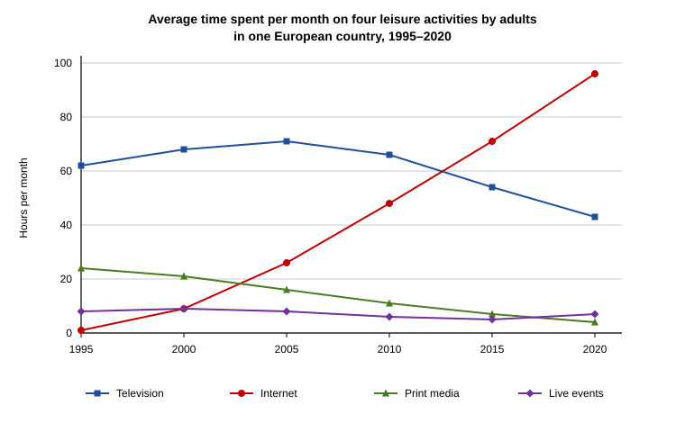

# Diagnostic — baseline before any study

Purpose: establish a **real** band baseline so the study plan targets actual gaps, not
assumed ones. Everything in `study-plan.md` is derived from this file.

**Status: D1 issued 26 Jul 2026. Awaiting Sara's script. Not yet marked.**

---

## ⚠️ Read this before you read anything else in this folder

This folder deliberately does **not** yet contain Task 1 technique notes, model answers,
or a list of "useful phrases for describing trends."

That is not an oversight. If you read the convention before you write D1, the diagnostic
measures nothing — it tells us how well you can follow instructions you read ten minutes
ago, which we already know. The whole value of D1 is that it captures what you produce
from **22 years of professional writing instinct and no exam training**, because that is
precisely the gap we need to size.

`writing-task-1.md` gets written **after** D1 is marked, and it gets written around your
actual errors.

So: write D1 first. Do not read ahead. Do not look up "IELTS Task 1 structure."

---

## The diagnostic battery

Five sittings. D1 is issued below; the rest follow as each is marked, so that each paper
is sat cold.

| | Section | Time | Can I administer and mark it? |
|---|---|---|---|
| **D1** | **Writing Task 1** (Academic) | **20 min** | **Yes — issued below** |
| D2 | Writing Task 2 | 40 min | Yes |
| D3 | Reading (Academic, 3 passages) | 60 min | Yes |
| D4 | Listening (4 sections) | ~30 min + transfer | **Partly — see below** |
| D5 | Speaking (Parts 1–3) | 11–14 min | **Partly — see below** |

**Honest limits on D4 and D5.** I can write and mark Reading and Writing to exam standard.
I cannot produce IELTS Listening audio, and I cannot hear you speak.

- **D4 Listening** needs authentic audio. Use **Cambridge IELTS 19** (or 18) — the official
  past-paper series, the only material with real difficulty calibration. I supply the
  protocol and mark the answer sheet; the audio has to be the real thing. Free practice
  audio on YouTube is not calibrated and will give you a false reading.
- **D5 Speaking** — I supply the full examiner script with real timings (Part 2 is exactly
  1 min prep / 1–2 min talk). Record yourself on your phone, transcribe it, and I mark the
  transcript against the Speaking descriptors. The catch: **pronunciation is one of the
  four Speaking criteria and I cannot assess it from a transcript.** I will mark the other
  three (Fluency & Coherence, Lexical Resource, Grammatical Range & Accuracy) and say so
  explicitly rather than invent a pronunciation score.

Given the README's prediction that Speaking is your strongest section and Listening is the
risk, D4 is the one worth spending money on. Order a Cambridge book this week.

---

# D1 — Writing Task 1 (Academic)

## Exam conditions — set these up before you start

You are sitting **computer-delivered**, so replicate that, not handwriting:

1. **Plain text editor.** TextEdit, Notepad, or a blank doc — **spellcheck and autocorrect
   OFF.** This matters more than it sounds: computer-delivered IELTS has **no spellcheck
   and no autocorrect.** Spelling and word-formation errors are marked under Lexical
   Resource. If you practise with autocorrect on, you will not see your own error rate.
2. **20 minutes, hard stop.** Timer visible. When it hits 20:00 you stop mid-word.
3. No dictionary, no internet, no notes, no reading ahead in this folder.
4. One sitting, no pausing the timer, phone face down.
5. Do not revise it afterwards. Send me exactly what was on screen at 20:00, typos and all.
   A cleaned-up script is worthless to me.

Computer-delivered does give you a **live word counter** — use it, it removes the single
most common cause of an accidental under-length penalty.

Note your actual finish time even if it is under 20 minutes. Time-in-hand is data.

---

## The task

> You should spend about 20 minutes on this task.
>
> The graph below shows the average time spent per month on four leisure activities by
> adults in one European country between 1995 and 2020.
>
> **Summarise the information by selecting and reporting the main features, and make
> comparisons where relevant.**
>
> Write at least 150 words.

*(PNG copy at `assets/diagnostic-d1-chart.png` if the SVG does not render.)*

---

### Fallback data table — use only if the chart will not display

Read the **chart** if you can. Estimating values off gridlines is part of what Task 1
tests, and working from exact figures makes your approximation language look better than
it is. If you use this table, tell me, and I will discount that criterion in the marking.

Reveal fallback figures (hours per month)

| Year | Television | Internet | Print media | Live events |
|---|---|---|---|---|
| 1995 | 62 | 1 | 24 | 8 |
| 2000 | 68 | 9 | 21 | 9 |
| 2005 | 71 | 26 | 16 | 8 |
| 2010 | 66 | 48 | 11 | 6 |
| 2015 | 54 | 71 | 7 | 5 |
| 2020 | 43 | 96 | 4 | 7 |

---

## When you finish

Paste the script back to me with three numbers:

1. **Word count** (exact — from the counter, not estimated)
2. **Finish time** (mm:ss, or "ran out")
3. **Where the time went** — roughly: how long staring at the chart before typing, how
   long typing, whether you re-read it at the end

That third number is diagnostically the most useful thing you can give me. A 20-minute
task lost on the wrong thing is a different problem from a language problem, and it is
fixed differently.

---

## Marking — to be completed on receipt

Marked against the four public Task 1 criteria, each 0–9, equally weighted, then averaged:
Task Achievement · Coherence & Cohesion · Lexical Resource · Grammatical Range & Accuracy.
Criteria and band-by-band wording: `band-descriptors.md`.

The two hard ceilings that catch experienced writers, stated now so the mark is not a
surprise later — **no overview caps Task Achievement at band 5**, and **under 150 words is
penalised under Task Achievement.** Both are mechanical. Neither has anything to do with
how well you write English.

| Criterion | Band | Evidence |
|---|---|---|
| Task Achievement | — | |
| Coherence & Cohesion | — | |
| Lexical Resource | — | |
| Grammatical Range & Accuracy | — | |
| **Task 1 band** | **—** | |

Reminder on weighting when reading the result: **Task 1 is one third of the Writing score,
Task 2 is two thirds** — `Writing = (T1 + 2×T2) / 3`. A poor Task 1 alone will not sink
Writing. It is worth fixing first anyway, because it is the cheapest band on the whole
exam to buy: the convention is small, fixed, and learnable in days.
